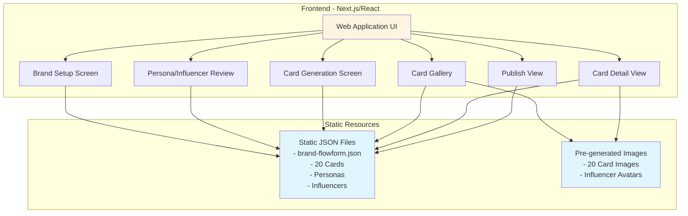
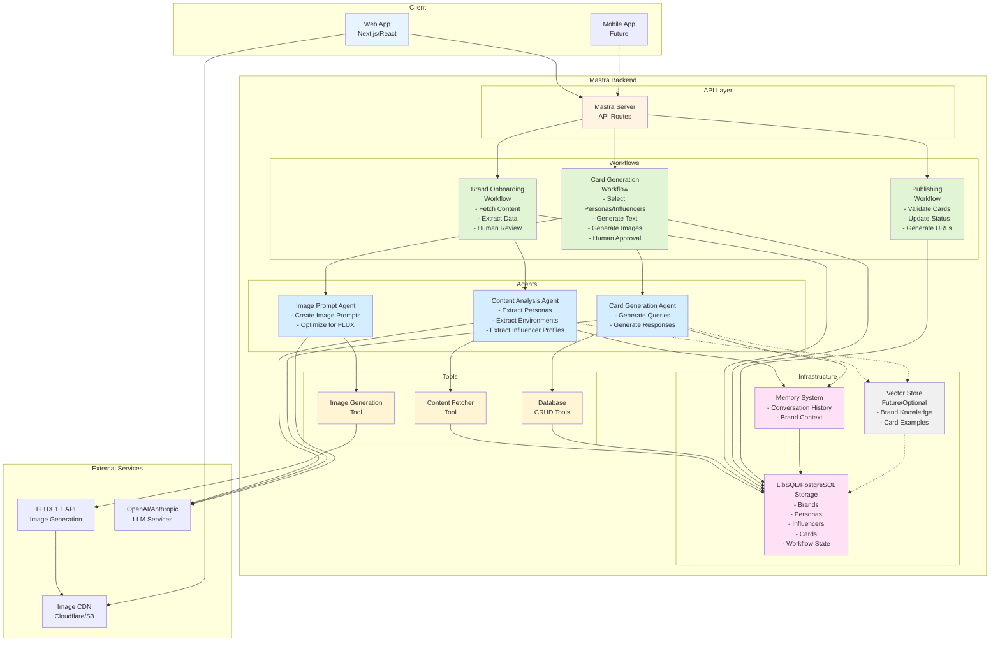
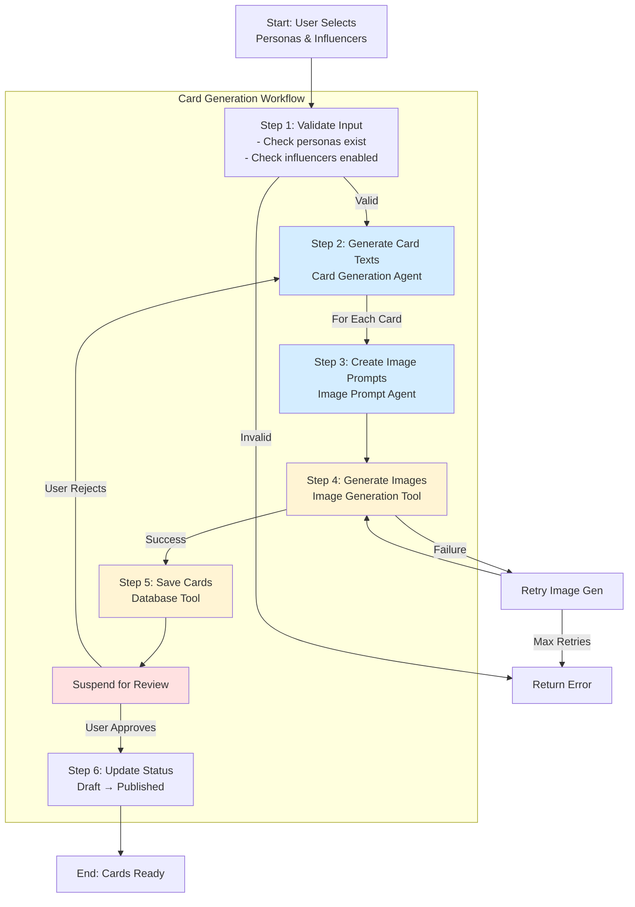
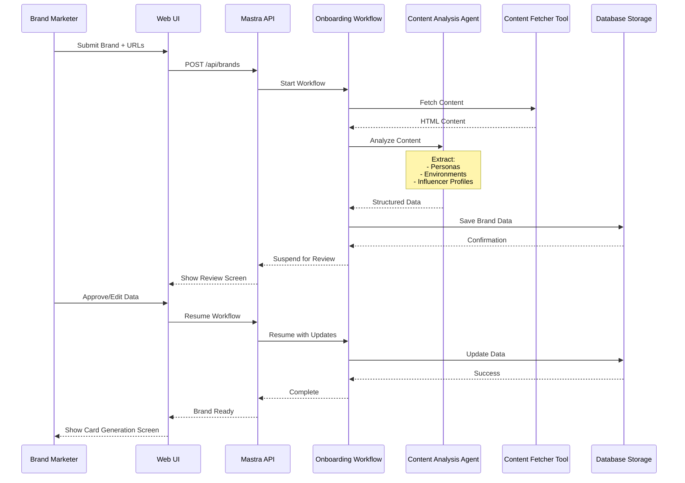

# Wisdom Pixels Backend Architecture

## Recommended Mastra Features

Based on the Wisdom Pixels requirements, the following Mastra features are recommended:

### 1. **Agents**
Agents will handle the AI-powered content generation and analysis:

- **Content Analysis Agent**: Extracts personas, environments, and influencer profiles from brand marketing content
- **Card Generation Agent**: Generates customer queries and influencer-endorsed responses
- **Image Prompt Agent**: Creates detailed prompts for image generation based on card context

**Why Agents?**
- Complex reasoning required for extracting structured data from unstructured marketing content
- Context-aware generation of natural queries and responses
- Can use tools to fetch content and call external services

### 2. **Workflows**
Workflows orchestrate the multi-step card generation process:

- **Brand Onboarding Workflow**: Handles content ingestion → extraction → review
- **Card Generation Workflow**: Orchestrates persona/influencer selection → text generation → image generation
- **Publishing Workflow**: Manages card approval and status transitions

**Why Workflows?**
- Multi-step process with clear dependencies (extract before generate)
- Human-in-the-loop approval steps (suspend/resume for brand review)
- Error handling and retry logic for external API calls
- State management across steps

### 3. **Tools**
Tools provide integration with external services and utilities:

- **Content Fetcher Tool**: Fetches and processes marketing content from URLs
- **Image Generation Tool**: Integrates with FLUX 1.1 or similar image generation APIs
- **Database Tools**: CRUD operations for brands, personas, influencers, and cards

**Why Tools?**
- Reusable across different agents and workflows
- Structured input/output validation with Zod schemas
- Can be called by agents when needed

### 4. **Storage (LibSQL/PostgreSQL)**
Persist application data:

- Brands, Personas, Environments, Influencers
- Cards (with queries, responses, image URLs, status)
- Workflow state and execution history
- Memory/conversation threads for brand interactions

**Why Storage?**
- Workflows need persistent state for suspend/resume
- Memory requires storage for conversation history
- Production app needs reliable data persistence

### 5. **Memory** (Optional for v0, Recommended for Production)
Track conversations and context:

- Maintain brand interaction history
- Remember user preferences and feedback
- Context for iterative card refinement

**Why Memory?**
- Multi-turn conversations with brand marketers
- Maintain context across sessions
- Improve quality through learning from feedback

### 6. **RAG (Future Enhancement)**
Retrieve brand-specific knowledge when generating cards:

- Store and retrieve brand guidelines, tone, voice
- Access product features and benefits
- Reference successful card examples

**Why RAG?**
- Ensures consistency with brand messaging
- Reduces hallucination by grounding responses in brand data
- Scales to multiple brands with dedicated knowledge bases

---

## System Architecture Diagrams

### v0 Demo Architecture (Current - Hackathon)

---

### Future Production Architecture (with Mastra)

---

### Detailed Card Generation Workflow

---

### Data Flow: Brand Onboarding to Card Publication

---

## Key Architecture Decisions

### 1. **Why Workflows over Direct Agent Calls?**
   - **Suspend/Resume**: Brand marketers need to review and approve extracted data and generated cards
   - **State Management**: Track progress through multi-step generation (30+ cards per brand)
   - **Error Recovery**: Retry image generation or text generation on failure
   - **Auditability**: Log each step for debugging and compliance

### 2. **Why Multiple Agents vs. One Agent?**
   - **Separation of Concerns**: Content extraction requires different capabilities than text generation
   - **Specialized Models**: Can use different LLMs for different tasks (e.g., GPT-4 for extraction, GPT-4o-mini for generation)
   - **Parallel Execution**: Image prompt generation can happen in parallel with text generation
   - **Easier Testing**: Test each agent independently

### 3. **Why Tools for External Services?**
   - **Reusability**: Same image generation tool used by multiple agents/workflows
   - **Schema Validation**: Ensure image prompts match FLUX 1.1 requirements
   - **Error Handling**: Centralized retry logic and error messages
   - **Cost Tracking**: Monitor API usage per tool

### 4. **Storage Choice: LibSQL vs. PostgreSQL**
   - **v0/Demo**: LibSQL (in-memory or file-based) for simplicity
   - **Production**: PostgreSQL for:
     - Better query performance for card filtering/search
     - Full-text search for finding cards by query/response
     - Robust backup and replication
     - Existing ecosystem (e.g., Prisma, PostgREST)

### 5. **When to Use Memory?**
   - **Multi-Turn Conversations**: Brand marketer iterates on card generation with feedback
   - **Context Preservation**: Remember previous generations and user preferences
   - **Personalization**: Tailor responses based on brand's industry, tone, etc.

### 6. **Future: Why RAG?**
   - **Brand Guidelines**: Retrieve tone of voice, prohibited terms, compliance rules
   - **Product Catalog**: Access full product specs when generating responses
   - **Card Templates**: Learn from high-performing cards
   - **Multi-Brand**: Scale to 100+ brands without fine-tuning per brand

---

## Implementation Phases

### **Phase 1: v0 Demo (Current)**
- Static JSON + Pre-generated images
- Next.js frontend only
- No Mastra backend

### **Phase 2: Mastra Backend Foundation**
- Set up Mastra server with Storage (LibSQL)
- Implement Content Analysis Agent
- Implement Brand Onboarding Workflow (no suspend/resume yet)
- Database Tools for CRUD operations

### **Phase 3: Card Generation**
- Implement Card Generation Agent
- Implement Image Prompt Agent
- Integrate Image Generation Tool (FLUX 1.1 API)
- Implement Card Generation Workflow

### **Phase 4: Human-in-the-Loop**
- Add Workflow suspend/resume for brand review
- Implement approval UI in frontend
- Add Memory for conversation tracking

### **Phase 5: Scale & Polish**
- Migrate to PostgreSQL for production
- Add RAG for brand knowledge
- Implement multi-brand support
- Add observability and monitoring

---

## Technology Stack Summary

| Component | v0 Demo | Production |
|-----------|---------|------------|
| **Frontend** | Next.js + React | Next.js + React |
| **Backend** | None (static) | Mastra Server |
| **Agents** | N/A | Mastra Agents (GPT-4, GPT-4o-mini) |
| **Workflows** | N/A | Mastra Workflows |
| **Tools** | N/A | Mastra Tools |
| **Storage** | Static JSON | LibSQL → PostgreSQL |
| **Memory** | N/A | Mastra Memory |
| **RAG** | N/A | Future: Mastra RAG |
| **Image Gen** | Pre-generated | FLUX 1.1 API |
| **Image Hosting** | Local/Vercel | Cloudflare R2 / S3 + CDN |
| **LLM Provider** | N/A | OpenAI / Anthropic |
| **Deployment** | Vercel | Vercel / Cloud Run |

---

## Next Steps

1. **Complete v0 demo** with static data (as per plan)
2. **Set up Mastra project** with basic server configuration
3. **Implement Content Analysis Agent** and test with FlowForm marketing content
4. **Build Brand Onboarding Workflow** with single-step extraction
5. **Add suspend/resume** for human review
6. **Implement Card Generation Workflow** with text generation first
7. **Integrate FLUX 1.1** via Image Generation Tool
8. **Add Memory** for multi-turn conversations
9. **Scale to production** with PostgreSQL and monitoring
