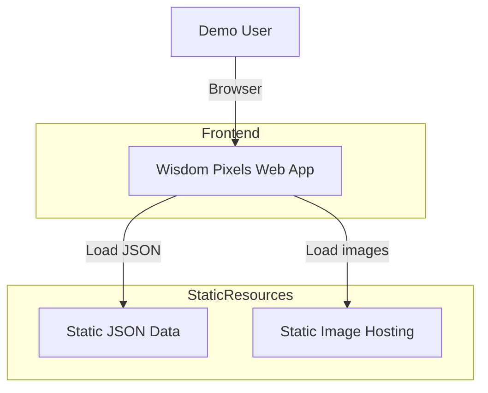

=== document: plans/wisdom-pixels-demo-plan.md ===

1. Title and metadata

Project name: Wisdom Pixels – FlowForm v0 Demo
Version: 0.1-draft
Owners: Kirill (Founder/PM), Core Hackathon Team
Date: 2025-11-23
Contact: [to-fill] (email/Slack)
Document ID: WP-SRS-PRD-001

Summary:
This document defines the product requirements, system requirements, architecture, and an iterative implementation and test plan for the Wisdom Pixels v0 hackathon demo. The purpose is to build a 3–5 minute demo that showcases how Wisdom Pixels turns a brand’s marketing content into influencer-backed AI training cards: each card contains a customer query to an LLM (mentioning an influencer), an influencer-endorsed response recommending the product in context, and a photorealistic image of the influencer using the product in an environment that resonates with the customer. Scope is limited to a single fictional product (FlowForm Motion Suit), synthetic influencers, and a fully working front-end with static JSON data and pre-generated images.

2. PRD (Stakeholder and system needs per IEEE 29148)

2.1 Problem statement

Brands care increasingly about how AI assistants (e.g., ChatGPT) describe their products. Today they manually create landing pages and influencer content, but they do not systematically generate aligned, multi-modal examples that AI systems can learn from. They also lack tools that connect product understanding, influencer narratives, and visual assets into a single, structured training dataset.

2.2 Users and value

Primary user:
Brand marketer, growth lead, or agency strategist responsible for performance marketing, SEO/AEO (Answer Engine Optimization), and influencer campaigns.

Secondary (future) user:
Influencer/creator who licenses their likeness and shares generated assets.

Value propositions:
• Automatically transform existing marketing pages into a set of influencer-backed AI training cards (query, answer, image).
• Provide visually striking, consistent influencer imagery that matches extracted personas and environments.
• Enable brands to curate and publish these cards with unique URLs, ready for tracking, sharing, and eventual use in LLM training/finetuning.
• Demonstrate multiple influencer profiles (with age and background diversity) for the same product and personas.

2.3 Business goals

```
• Deliver a compelling hackathon demo that clearly explains Wisdom Pixels and FlowForm in 3–5 minutes.
• Showcase 20 high-quality cards (20 images) for a single product, across multiple personas and influencers.
• Validate that the “card” abstraction is understandable and attractive to brand/influencer stakeholders.
• Create an implementation path that can evolve from demo to real product (back-end, real LLM/image generation, influencer licensing).
```

2.4 Success metrics (for v0 demo)

```
Demo-level metrics:
  • Demo clarity: >80% of viewers can explain “what Wisdom Pixels does” after watching (informal feedback).
  • Visual impact: reviewers describe the demo as “beautiful”, “striking”, or “cool” in feedback.
  • Flow smoothness: full end-to-end demo can be completed reliably in under 3 minutes without manual fixes.

Technical metrics:
  • Gallery of 20 cards loads in under 2 seconds on a typical laptop and stable network.
  • Card detail views render images without broken links in >95% of runs during practice.
  • No runtime errors in console during a full demo run.
```

2.5 Scope

```
In scope (v0 hackathon):
  • Single brand: FlowForm Motion Suit (fictional).
  • Ingestion UI for brand and marketing URLs (logic can be mocked).
  • Representation and UI review of:
    – Customer personas.
    – Environments.
    – Multiple influencer profiles (first in their 30s, others diverse).
  • Influencer roster selection (single and mixed modes).
  • Card generation trigger (front-end only, backed by static JSON).
  • Card gallery UI (grid of 20 FlowForm cards).
  • Card detail UI (full image, query, response, card URL).
  • Card status transitions (draft → published) and basic “publish” view.
  • Unique URL per card for tracking/crawlability (front-end routing).
  • Minimal telemetry (e.g., local view counts).

Out of scope (v0 hackathon):
  • Real-time LLM or image model calls in the demo.
  • Real back-end persistence, multi-tenant security, auth.
  • Real influencer contracts, licensing, or payment.
  • Medical claims validation or regulatory compliance engine.
  • Multi-brand support in production-grade fashion (only FlowForm is required).
  • SEO metadata (schema.org, sitemaps, etc.) and integrated analytics stack.
```

2.6 Dependencies

```
• Pre-generated marketing text for FlowForm (fake landing page and supporting copy).
• Pre-computed personas, environments, influencer profiles, and 20 cards (queries, responses, image URLs) in JSON.
• Pre-generated 20 photorealistic images using a model like FLUX 1.1 that match the cards’ briefs.
• Front-end stack: Node/React/Next.js (or similar SPA framework).
• Infrastructure: static hosting or similar for UI and image assets (e.g., Vercel, Netlify, S3+CloudFront).
• Version control: Git repository for code and JSON data.
```

2.7 Risks

```
• Image quality risk: some generated images may look uncanny or inconsistent with descriptions.
• Time risk: implementing too much non-essential functionality could derail the hackathon schedule.
• Concept clarity risk: audience may not immediately grasp “AI training card” concept if explanation is muddled.
• Demo fragility: network issues, broken static asset paths, or routing errors may break the demo.
```

2.8 Assumptions (high-level, detailed in section 11 as well)

```
• All data is synthetic (no PII or real influencers).
• FlowForm is fictional and not subject to real medical device regulation.
• Evaluators understand what ChatGPT-like systems are and accept “AI training sample” as a concept.
• Team can precompute all JSON and images before the presentation.
```

2.9 Non-goals

```
• Delivering a fully scalable production system.
• Building an internal LLM training pipeline in this iteration.
• Handling multi-language content or internationalization.
• Supporting mobile-native apps (web is enough).
```

3. SRS – System requirements

3.1 Functional requirements (REQ-###, type: func)

Table: Functional requirements

| ID      | Type | Description                                                                                                          | Priority |
| ------- | ---- | -------------------------------------------------------------------------------------------------------------------- | -------- |
| REQ-001 | func | System shall allow creation of a Brand (FlowForm) with name and root domain, and accept one or more marketing URLs.  | Must     |
| REQ-002 | func | System shall present extracted Personas, Environments, and Influencer Profiles for the Brand in a review UI.         | Must     |
| REQ-003 | func | System shall support multiple Influencer instances per Brand, with enable/disable toggles and a default indicator.   | Must     |
| REQ-004 | func | System shall allow selecting influencer mode for card generation: single influencer or mixed multiple influencers.   | Must     |
| REQ-005 | func | System shall allow configuring number of cards to generate (e.g., 5/10/20) and trigger generation for a Brand.       | Must     |
| REQ-006 | func | System shall display a Card Gallery grid for a Brand, showing each card’s thumbnail image, influencer, and query.    | Must     |
| REQ-007 | func | System shall filter cards in the Gallery by Influencer and by Persona.                                               | Should   |
| REQ-008 | func | System shall present a Card Detail view with full image, query, response, influencer, persona, environment, and URL. | Must     |
| REQ-009 | func | System shall allow editing of query and response text in the Card Detail view, updating local state.                 | Should   |
| REQ-010 | func | System shall assign a unique, stable URL path to each Card and render a card page at that URL.                       | Must     |
| REQ-011 | func | System shall allow changing a Card’s status (Draft/Ready/Published) and listing published cards with URLs.           | Must     |
| REQ-012 | func | System shall increment a simple view count each time a Card is viewed (telemetry).                                   | Should   |
| REQ-013 | func | System shall support at least 5 synthetic Influencer profiles for FlowForm with diverse age ranges and roles.        | Must     |
| REQ-014 | func | System shall display at least 20 cards for FlowForm, using multiple personas, influencers, and environments.         | Must     |

3.2 Non-functional requirements (NFR, type: nfr/perf/etc.)

Table: Non-functional requirements

| ID      | Type | Description                                                                                            | Priority |
| ------- | ---- | ------------------------------------------------------------------------------------------------------ | -------- |
| REQ-101 | nfr  | Usability: Demo flows must be discoverable and executable by a new user in under 3 minutes.            | Must     |
| REQ-102 | perf | Performance: Gallery of 20 cards shall load in under 2 seconds on a standard laptop and good network.  | Must     |
| REQ-103 | nfr  | Reliability: The UI must handle missing images by showing a placeholder instead of breaking.           | Must     |
| REQ-104 | nfr  | Security: Only synthetic, non-PII data is stored and served; no authentication needed for v0.          | Must     |
| REQ-105 | nfr  | Portability: System should run locally with minimal setup (Node, one command).                         | Should   |
| REQ-106 | nfr  | Maintainability: Data structures (Brand, Persona, Influencer, Card) shall be defined in a single place | Must     |

3.3 Interfaces and APIs (type: int)

For v0, main interface is the front-end UI plus static JSON files. However, define forward-compatible contracts.

Table: Interface requirements

| ID      | Type | Description                                                                                                                   |
| ------- | ---- | ----------------------------------------------------------------------------------------------------------------------------- |
| REQ-201 | int  | UI shall load Brand, Persona, Influencer, Environment, and Card data from a JSON file (or API endpoint with the same schema). |
| REQ-202 | int  | UI shall route to card detail URLs using client-side routing (e.g., /cards/{cardId}).                                         |
| REQ-203 | int  | In future, UI should be able to swap JSON file for REST endpoints without breaking contracts (same JSON shape per entity).    |

3.4 Data requirements (type: data)

Table: Data requirements

| ID      | Type | Description                                                                                                                                           |
| ------- | ---- | ----------------------------------------------------------------------------------------------------------------------------------------------------- |
| REQ-301 | data | Each Card shall reference valid Brand, Persona, Influencer, and (optionally) Environment IDs that exist in the Brand-scoped data.                     |
| REQ-302 | data | Each Card’s query shall mention the Influencer’s name textually (as per preference: influencer endorsement is central).                               |
| REQ-303 | data | Each Card shall have a non-empty imageUrl pointing to a valid image resource; images shall be photorealistic stills.                                  |
| REQ-304 | data | Each Card’s url shall be unique per Brand and stable between runs.                                                                                    |
| REQ-305 | data | All Influencer instances for FlowForm shall be synthetic, with age ranges and bios matching their defined profiles and not impersonating real people. |
| REQ-306 | data | All content (queries/responses) must avoid medical claims; phrasing should emphasize form feedback and awareness, not diagnosis or treatment.         |

3.5 Error and telemetry expectations

```
• On data load error (JSON failure), UI should show a clear error banner and not crash.
• On image load failure, UI should show a placeholder image icon and keep layout stable.
• For telemetry, the system will maintain:
  – A simple per-card view count in front-end memory (or local store) for demonstration.
  – Optional: simple click logging in console for debugging.
• No PII logs are kept; all telemetry is synthetic and demo-only.
```

3.6 Acceptance criteria (mapping to TEST-###)

High-level mapping is defined in section 6 (Tests Overview). In summary:
• Each functional requirement REQ-001..014 has at least one acceptance test (TEST-001..014).
• Non-functional requirements REQ-101..106 have corresponding perf/usability tests (TEST-101..106).
• Data requirements REQ-301..306 have data validation tests (TEST-301..306).

3.7 System architecture diagram

3.7.1 Mermaid diagram



3.7.2 C4-style ASCII representation

Context level:
[User] --uses--> [Wisdom Pixels Web App]
[Wisdom Pixels Web App] --reads--> [Static JSON Data]
[Wisdom Pixels Web App] --loads--> [Image Hosting/CDN]

Container level:
Container: Web Browser (React/Next.js SPA)
• Components:
– BrandDashboard
– BrandSetup
– PersonaInfluencerReview
– InfluencerRoster
– CardGenerator
– CardGallery
– CardDetail
– PublishView

```
Container: Static JSON Repo
  • Files:
    – brand-flowform.json (Brand, Personas, Environments, Influencers, Cards)

Container: Static Image Host
  • Assets:
    – /images/cards/{cardId}.jpg (20 card images)
    – /images/influencers/{influencerId}.jpg
```

4. Detailed iterative implementation and test plan (12207 + 29119-3)

4.1 Overall approach and environments

```
• Process: Agile, TDD-inspired loop: Red → Green → Refactor → Measure.
• Verification-first: design acceptance tests based on REQ/TEST mapping before implementation.
• Environments:
  – Dev: local Node + browser (Chrome/Edge).
  – Demo: deployed static hosting (e.g., Vercel/Netlify).
• Tooling:
  – Git for version control and state safety (revert to last GREEN commit when needed).
  – NPM/Yarn for dependencies.
  – Jest/React Testing Library (optional) for basic component tests.
• Roles:
  – PM (Kirill): maintains requirements, validates UX.
  – Front-end engineer: implements UI and wiring.
  – Designer (optional): refines aesthetics.
```

4.2 Suspension and resumption criteria

```
• Suspend:
  – If any critical TEST (type acceptance) fails repeatedly and cannot be addressed within planned timebox.
  – If architecture changes are required that invalidate more than 3 completed phases.
• Resume:
  – Once failure root cause is identified and a rollback or fix plan is agreed.
  – After reverting to last GREEN commit if necessary.
```

4.3 Risk register

| Risk ID | Risk                                    | Trigger                                                 | Mitigation                                                                                       |
| ------- | --------------------------------------- | ------------------------------------------------------- | ------------------------------------------------------------------------------------------------ |
| R-01    | Demo break due to routing issues        | 404 or blank page in card detail during demo            | Implement integration tests for core routes; dry-run full demo path multiple times.              |
| R-02    | Image quality not matching descriptions | Images appear uncanny/unprofessional                    | Curate/regenerate images beforehand; manually QA all 20 images; adjust prompts as needed.        |
| R-03    | Performance lag in gallery              | Gallery loads slowly or stutters                        | Optimize image sizes; lazy-load thumbnails; prefetch JSON.                                       |
| R-04    | Scope creep                             | Adding extra features (analytics, SEO) during hackathon | Enforce MoSCoW priorities; track feature creep % per phase; cut non-essential items proactively. |
| R-05    | Confusing UX                            | Reviewers do not understand concept quickly             | Refine labels and copy; create a simple demo script; conduct 1–2 dry-run user walk-throughs.     |

4.4 Master phase schedule (WBS summary)

Table: Phases overview

| Phase ID | Name                                 | Primary goal                                                 | Dependencies |
| -------- | ------------------------------------ | ------------------------------------------------------------ | ------------ |
| P00      | Repo and project scaffold            | Basic React/Next app scaffold, routing skeleton              | None         |
| P01      | Data model and static JSON seed      | Define schemas and seed FlowForm data (brand, personas, etc) | P00          |
| P02      | Brand setup and content ingestion UI | Implement brand creation/URL input and analysis stub         | P01          |
| P03      | Persona & environment review UI      | Display extracted personas/environments for review           | P02          |
| P04      | Influencer roster UI and logic       | Multi-influencer cards, toggles, default selection           | P03          |
| P05      | Card generation configuration UI     | Influencer mode selection, card count, generate trigger      | P04          |
| P06      | Card gallery UI and filtering        | Grid view of cards, filters by influencer/persona            | P05          |
| P07      | Card detail view and editing         | Full card view, text editing, unique URL routing             | P06          |
| P08      | Publish view and status transitions  | Draft/Ready/Published, list of URLs                          | P07          |
| P09      | Telemetry stub and polish            | View counters, error handling, final UX polish               | P08          |

4.5 Detailed phase specifications

For each phase: Scope, tests, exit criteria, metrics.

Phase P00 – Repo and project scaffold

```
A. Scope and objectives (Impacted REQ)
  • Implement minimal React/Next.js app with:
    – Home route and brand route placeholders.
    – Routing capability for card URLs.
  • Requirements: REQ-101, REQ-105, REQ-201, REQ-202 (partial).

B. Per-phase test plan
  • TEST items:
    – TEST-101: App boots without errors locally.
    – TEST-201: Base routes (/, /brand/flowform, /cards/[id]) resolve to placeholder components.
  • Approach:
    – Manual browser verification.
    – Optional Jest snapshot tests for top-level components.
  • Pass/fail criteria:
    – Pass: All routes load with visible placeholders, no console errors.
    – Fail: Any route returns 404 or runtime error.

C. Exit gate rules
  • Green: All planned routes work, no critical console errors.
  • Yellow: Minor warnings only; acceptable for now; logged for later.
  • Red: Any route breaks; cannot proceed.

D. Phase metrics

  | Metric                     | Value | Rationale                                           |
  |----------------------------|-------|-----------------------------------------------------|
  | Confidence %               | 90    | Standard scaffold, low complexity                   |
  | Long-term robustness %     | 80    | Next.js boilerplate is durable                      |
  | Internal interactions      | 2     | Layout + Router components                          |
  | External interactions      | 1     | Browser/Node APIs                                   |
  | Complexity %               | 20    | Simple routing and bootstrapping                    |
  | Feature creep %            | 10    | Risk of adding UI polish prematurely                |
  | Technical debt %           | 20    | Minimal shortcuts acceptable                        |
  | YAGNI %                    | 80    | Keep only essential scaffold                        |
  | MoSCoW category            | Must  | Foundation for all other phases                     |
  | Local vs Non-local changes | Local | Mostly in app scaffold                              |
  | Architectural changes      | 1     | Initial skeleton only                               |
```

Phase P01 – Data model and static JSON seed

```
A. Scope and objectives (Impacted REQ)
  • Define TypeScript types/interfaces for Brand, Persona, Environment, Influencer, Card (per section 8).
  • Create brand-flowform.json file with:
    – 1 Brand (FlowForm).
    – 4 Personas.
    – 3–5 Environments.
    – 5 Influencers (first ~30s, rest diverse).
    – 20 Cards with populated fields and image URLs.
  • Requirements: REQ-301..305, REQ-013, REQ-014, REQ-106.

B. Per-phase test plan
  • Test items:
    – TEST-301: All card IDs reference valid persona, influencer, environment IDs.
    – TEST-302: Every card query contains influencer name string.
    – TEST-303: All imageUrl fields are non-empty and HTTP/relative paths.
    – TEST-305: Influencer profiles have distinct age ranges and tags.
  • Approach:
    – Node script / Jest test to validate JSON.
  • Pass/fail criteria:
    – Pass: All data integrity tests pass; 20 cards present.
    – Fail: Any missing references or broken invariants.

C. Exit gate rules
  • Green: JSON passes validation, 20 cards ready.
  • Yellow: Minor text edits needed; structure correct.
  • Red: Data invalid; must fix before UI work.

D. Phase metrics

  | Metric                     | Value | Rationale                                           |
  |----------------------------|-------|-----------------------------------------------------|
  | Confidence %               | 85    | Data entry can be tedious but straightforward       |
  | Long-term robustness %     | 90    | Single source of truth for schemas                  |
  | Internal interactions      | 3     | Types, JSON, validator script                       |
  | External interactions      | 1     | Node/Jest runtime                                   |
  | Complexity %               | 35    | Schema consistency and constraints                  |
  | Feature creep %            | 20    | Temptation to add extra fields                      |
  | Technical debt %           | 25    | Some shortcuts likely in text quality               |
  | YAGNI %                    | 75    | Avoid extra fields beyond v0 scope                  |
  | MoSCoW category            | Must  | Critical to all UI layers                           |
  | Local vs Non-local changes | Non-local | Changes affect all consumer components         |
  | Architectural changes      | 1     | Data layer stabilization                            |
```

Phase P02 – Brand setup and content ingestion UI

```
A. Scope and objectives (Impacted REQ)
  • Implement “Add Brand” / Brand Setup UI for FlowForm:
    – Fields: brand name, domain, URLs list.
    – “Analyze content” button.
  • Show loading state and then navigate to Persona/Influencer review using seed data.
  • Requirements: REQ-001, REQ-101, REQ-201 (front-end), plus user preference: landing page/marketing content as inputs.

B. Per-phase test plan
  • Test items:
    – TEST-001: Brand form accepts name/domain/URLs and responds to click.
    – TEST-101: A new user can trigger analysis in <30 seconds.
  • Approach:
    – Manual UX test; optional cypress test for flow.
  • Pass/fail criteria:
    – Pass: Form submits, transitions to next screen, no errors.
    – Fail: Form broken or confusing.

C. Exit gate rules
  • Green: Setup flow works smoothly and is understandable.
  • Yellow: Minor copy tweaks pending.
  • Red: Users get stuck or cannot reach review screen.

D. Phase metrics

  | Metric                     | Value | Rationale                                     |
  |----------------------------|-------|-----------------------------------------------|
  | Confidence %               | 80    | UI wiring simple but UX copy needs care       |
  | Long-term robustness %     | 70    | Flow may be reworked later                    |
  | Internal interactions      | 3     | Form, router, data loader                     |
  | External interactions      | 0     | All local for demo                            |
  | Complexity %               | 30    | UX state transitions and validations          |
  | Feature creep %            | 25    | Temptation to add real analysis logic         |
  | Technical debt %           | 30    | Stubbed “analysis” behavior                   |
  | YAGNI %                    | 70    | Keep logic mocked, not real analysis          |
  | MoSCoW category            | Must  | Sets the story of ingestion                   |
  | Local vs Non-local changes | Local | Mostly affects setup screen                   |
  | Architectural changes      | 0     | No new containers                             |
```

Phase P03 – Persona and environment review UI

```
A. Scope and objectives (Impacted REQ)
  • Implement tabbed review UI:
    – Personas tab.
    – Environments tab.
    – (Optionally Influencer Profiles tab stub).
  • Display cards for each persona/environment with description and tags.
  • Requirements: REQ-002, REQ-101.

B. Per-phase test plan
  • Test items:
    – TEST-002: All FlowForm personas and environments from JSON are displayed.
    – TEST-102: Tabs are discoverable and easy to switch.
  • Approach:
    – Manual verification and simple component tests.
  • Pass/fail criteria:
    – Pass: Correct counts shown, no UI overlaps, simple navigation.
    – Fail: Entities missing or UI confusing.

C. Exit gate rules
  • Green: Personas/environments readable and obvious.
  • Yellow: Minor visual polish needed only.
  • Red: Data misaligned, wrong mapping from JSON.

D. Phase metrics

  | Metric                     | Value | Rationale                                      |
  |----------------------------|-------|-----------------------------------------------|
  | Confidence %               | 85    | Standard list rendering                       |
  | Long-term robustness %     | 80    | Tabs-based UI stable                          |
  | Internal interactions      | 3     | Tabs, list items, data                          |
  | External interactions      | 0     | None                                          |
  | Complexity %               | 25    | Mostly rendering                               |
  | Feature creep %            | 15    | Avoid inline editing in v0                     |
  | Technical debt %           | 20    | Limited                                        |
  | YAGNI %                    | 80    | Show-only, no heavy editing                    |
  | MoSCoW category            | Should| Nice to show but brand could skip quickly       |
  | Local vs Non-local changes | Local | UI layer                                      |
  | Architectural changes      | 0     | None                                          |
```

Phase P04 – Influencer roster UI and logic

```
A. Scope and objectives (Impacted REQ)
  • Implement Influencer tab with roster of influencer tiles:
    – Avatar, name, age range, tags, enable toggle, “Set default”.
  • Ensure at least 5 influencer instances loaded from JSON:
    – First ~30s; others diverse ages/profiles as per preferences.
  • Requirements: REQ-003, REQ-013, REQ-101.

B. Per-phase test plan
  • Test items:
    – TEST-003: All 5 influencers appear with correct ages/roles.
    – TEST-013: Toggling enabled/default flags updates UI state appropriately.
  • Approach:
    – Manual inspection; optional unit tests for state reducer.
  • Pass/fail criteria:
    – Pass: Influencers match JSON, toggles behave predictably.
    – Fail: Wrong count or toggles inconsistent.

C. Exit gate rules
  • Green: Roster is intuitive and functional.
  • Yellow: Minor styling/copy issues.
  • Red: Incorrect mapping or unstable toggling.

D. Phase metrics

  | Metric                     | Value | Rationale                                      |
  |----------------------------|-------|-----------------------------------------------|
  | Confidence %               | 80    | Straightforward state management               |
  | Long-term robustness %     | 75    | Likely re-used later for real influencers      |
  | Internal interactions      | 4     | Tabs, state, tiles, JSON                       |
  | External interactions      | 0     | None                                          |
  | Complexity %               | 35    | Managing default/enable logic                  |
  | Feature creep %            | 20    | Potential to add more influencer features      |
  | Technical debt %           | 25    | Simple but may be refactored later             |
  | YAGNI %                    | 75    | Avoid advanced features (earnings, approvals)  |
  | MoSCoW category            | Must  | Central to product concept                     |
  | Local vs Non-local changes | Local | UI and state only                              |
  | Architectural changes      | 0     | None                                          |
```

Phase P05 – Card generation configuration UI

```
A. Scope and objectives (Impacted REQ)
  • Implement “Generate cards” screen:
    – Persona selector (All or specific).
    – Influencer mode selector (single vs mixed).
    – Card count control (5/10/20).
    – “Generate cards” button.
  • Wire generation button to load pre-seeded cards for FlowForm.
  • Requirements: REQ-004, REQ-005, REQ-101.

B. Per-phase test plan
  • Test items:
    – TEST-004: Single influencer mode generates only that influencer’s cards.
    – TEST-005: Mixed mode distributes cards across selected influencers.
    – TEST-014: 20 cards appear when 20 is selected (for FlowForm dataset).
  • Approach:
    – Manual check; optional state tests.
  • Pass/fail criteria:
    – Pass: UI state and card load behavior match selection.
    – Fail: Mismatch in counts or influencer distribution.

C. Exit gate rules
  • Green: Selections are respected, gallery populates as expected.
  • Yellow: Non-critical misalignment in distribution (for demo, mostly visual).
  • Red: Cannot get 20 cards reliably; demo broken.

D. Phase metrics

  | Metric                     | Value | Rationale                                   |
  |----------------------------|-------|--------------------------------------------|
  | Confidence %               | 75    | Slight complexity coordinating filters     |
  | Long-term robustness %     | 70    | Logic may grow with real generation later  |
  | Internal interactions      | 4     | Influencer state, persona, cards, router   |
  | External interactions      | 0     | None                                       |
  | Complexity %               | 40    | Filtering and mapping                      |
  | Feature creep %            | 30    | Temptation to add real generation UI       |
  | Technical debt %           | 35    | Likely stubbed algorithms                  |
  | YAGNI %                    | 70    | Do not implement real LLM logic now        |
  | MoSCoW category            | Must  | Central to “generate cards” story          |
  | Local vs Non-local changes | Non-local | Affects gallery population             |
  | Architectural changes      | 0     | None                                       |
```

Phase P06 – Card gallery UI and filtering

```
A. Scope and objectives (Impacted REQ)
  • Implement gallery grid showing card thumbnails, influencer, query snippet, status.
  • Enable filters:
    – By influencer.
    – By persona.
  • Requirements: REQ-006, REQ-007, REQ-102, REQ-103.

B. Per-phase test plan
  • Test items:
    – TEST-006: All 20 cards render; thumbnails visible.
    – TEST-007: Filters correctly subset cards.
    – TEST-102: Gallery loads in <2 seconds.
    – TEST-103: Broken image fallback placeholder works.
  • Approach:
    – Manual / automated tests; measure with browser dev tools.
  • Pass/fail criteria:
    – Pass: Filtering and performance meet specs, no layout breaks.
    – Fail: Slow load or incorrect filtering.

C. Exit gate rules
  • Green: Smooth scroll and filter, visually compelling grid.
  • Yellow: Minor layout issues acceptable.
  • Red: Performance or filter logic broken.

D. Phase metrics

  | Metric                     | Value | Rationale                                |
  |----------------------------|-------|-----------------------------------------|
  | Confidence %               | 80    | Standard UI pattern                     |
  | Long-term robustness %     | 80    | Grid + filters reusable                 |
  | Internal interactions      | 5     | Cards state, filters, router, images    |
  | External interactions      | 1     | Image CDN                               |
  | Complexity %               | 45    | Interaction between filters and cards   |
  | Feature creep %            | 25    | Might add more filter types             |
  | Technical debt %           | 30    | Basic filter logic may be simple        |
  | YAGNI %                    | 70    | Avoid advanced sorting/search           |
  | MoSCoW category            | Must  | Demo focal point                        |
  | Local vs Non-local changes | Non-local | Affects many views                   |
  | Architectural changes      | 0     | None                                    |
```

Phase P07 – Card detail view and editing

```
A. Scope and objectives (Impacted REQ)
  • Implement card detail route/view:
    – Full-sized image.
    – Query (editable).
    – Response (editable).
    – Influencer, persona, environment labels.
    – Card URL + “Copy” button.
  • Ensure direct navigation via /cards/{cardId}.
  • Requirements: REQ-008, REQ-009, REQ-010, REQ-202.

B. Per-phase test plan
  • Test items:
    – TEST-008: Detail view shows correct card data from JSON.
    – TEST-009: Editing query/response updates state while on session.
    – TEST-010: URL copying works and matches route structure.
  • Approach:
    – Manual test; optional component unit tests.
  • Pass/fail criteria:
    – Pass: At least 2 cards verified to show correct data and allow edit.
    – Fail: Wrong card mapping or broken routing.

C. Exit gate rules
  • Green: Demo can click from gallery into detail and back without error.
  • Yellow: Minor styling/copy issues.
  • Red: Navigation fails or data mismapped.

D. Phase metrics

  | Metric                     | Value | Rationale                                  |
  |----------------------------|-------|-------------------------------------------|
  | Confidence %               | 80    | Known pattern in React/Next               |
  | Long-term robustness %     | 75    | Likely extended in later versions          |
  | Internal interactions      | 5     | Router, data lookup, image, controls      |
  | External interactions      | 1     | Clipboard API (for copy)                  |
  | Complexity %               | 45    | Routing and binding interactions          |
  | Feature creep %            | 25    | Potential for advanced editing            |
  | Technical debt %           | 35    | Some quick hacks allowed                  |
  | YAGNI %                    | 70    | Avoid full persisted editing              |
  | MoSCoW category            | Must  | Demonstrates card as training unit        |
  | Local vs Non-local changes | Non-local | Affects routing and data usage       |
  | Architectural changes      | 0     | None                                      |
```

Phase P08 – Publish view and status transitions

```
A. Scope and objectives (Impacted REQ)
  • Implement publish tab:
    – List of all cards with checkboxes.
    – Button “Publish selected cards”.
    – Status column (Draft/Ready/Published).
    – View listing published cards with URLs.
  • Requirements: REQ-011, REQ-101.

B. Per-phase test plan
  • Test items:
    – TEST-011: Cards can transition status within session.
    – TEST-111: Published cards list displays correct URLs and counts.
  • Approach:
    – Manual simulation of publish flow.
  • Pass/fail criteria:
    – Pass: At least 3 cards can be published and appear in list with proper URLs.
    – Fail: Wrong status or missing URLs.

C. Exit gate rules
  • Green: Simple publish story is coherent for demo.
  • Yellow: UI not perfect but functional.
  • Red: Status logic confusing or broken.

D. Phase metrics

  | Metric                     | Value | Rationale                               |
  |----------------------------|-------|----------------------------------------|
  | Confidence %               | 75    | Simple state transitions               |
  | Long-term robustness %     | 70    | Likely redesigned in production        |
  | Internal interactions      | 4     | Cards state, filters, UI               |
  | External interactions      | 0     | None                                   |
  | Complexity %               | 30    | Low-medium                             |
  | Feature creep %            | 20    | Risk of adding scheduling, etc.        |
  | Technical debt %           | 35    | Acceptable quick implementation        |
  | YAGNI %                    | 75    | Do not add complex workflows           |
  | MoSCoW category            | Should| Helpful but not as central as gallery  |
  | Local vs Non-local changes | Local | Status only                             |
  | Architectural changes      | 0     | None                                   |
```

Phase P09 – Telemetry stub and polish

```
A. Scope and objectives (Impacted REQ)
  • Implement simple view count increments when card detail is opened.
  • Show view counts in card gallery or detail.
  • Add basic error handling for JSON load and broken images.
  • Final UX polish for labels, copy, and navigation sequence.
  • Requirements: REQ-012, REQ-103, REQ-101.

B. Per-phase test plan
  • Test items:
    – TEST-012: View count increases when card is opened.
    – TEST-103: Placeholder image shown on failure.
    – TEST-101: Full 3-minute demo dry-run passes without confusion.
  • Approach:
    – Manual tests and final dry-run; optional integration test script.
  • Pass/fail criteria:
    – Pass: 2+ dry-runs of full demo with no critical issues.
    – Fail: Frequent breakage or user confusion.

C. Exit gate rules
  • Green: Demo-ready, known safe commit tagged.
  • Yellow: Minor cosmetic issues accepted; documented.
  • Red: Non-trivial bugs left; reconsider scope.

D. Phase metrics

  | Metric                     | Value | Rationale                                       |
  |----------------------------|-------|------------------------------------------------|
  | Confidence %               | 70    | End-game polishing often reveals issues        |
  | Long-term robustness %     | 65    | Telemetry and polish often reworked later      |
  | Internal interactions      | 5     | Cards, gallery, detail, error handlers         |
  | External interactions      | 1     | Console/browser APIs                           |
  | Complexity %               | 40    | Many small cross-cutting concerns              |
  | Feature creep %            | 35    | Risk to “just add one more tweak”              |
  | Technical debt %           | 40    | Some shortcuts acceptable pre-demo             |
  | YAGNI %                    | 70    | Limit to essentials for demo                   |
  | MoSCoW category            | Must  | Ensures end-to-end demo quality                |
  | Local vs Non-local changes | Non-local | Cross-cutting UX and behavior              |
  | Architectural changes      | 0     | None                                           |
```

5. Evaluations (YAML block)

evaluations:
- id: dev-e2e-demo
dataset: manual-demo-script
task: "Run full demo path from brand setup to published cards and card detail view"
metrics:
- name: success_rate
threshold: 1.0
- name: duration_seconds
threshold: 180
seed: 1
runtime_budget_seconds: 600

```
- id: ui-usability-pass
  dataset: "3 internal reviewers"
  task: "Assess understanding of product after demo"
  metrics:
    - name: understanding_score
      threshold: 0.8
    - name: confusion_reports
      threshold: 0
  seed: 2
  runtime_budget_seconds: 3600

- id: perf-gallery
  dataset: "20 card dataset on dev machine"
  task: "Measure gallery load time and FPS"
  metrics:
    - name: gallery_load_seconds
      threshold: 2.0
    - name: scroll_jank_events
      threshold: 0
  seed: 3
  runtime_budget_seconds: 600

- id: adversarial-routing
  dataset: "Random card IDs, invalid IDs"
  task: "Verify routing robustness"
  metrics:
    - name: 404_handled
      threshold: 1.0
    - name: crash_rate
      threshold: 0.0
  seed: 4
  runtime_budget_seconds: 600
```

6. Tests overview

Table: Tests and mappings

| TEST ID  | Type        | Description                                                   | Verifies REQ     |
| -------- | ----------- | ------------------------------------------------------------- | ---------------- |
| TEST-001 | acceptance  | Brand setup form and analyze trigger work                     | REQ-001          |
| TEST-002 | acceptance  | Personas and environments render correctly                    | REQ-002          |
| TEST-003 | acceptance  | Influencer roster shows 5 influencers and toggles work        | REQ-003, REQ-013 |
| TEST-004 | functional  | Single influencer mode generates only that influencer’s cards | REQ-004, REQ-005 |
| TEST-005 | functional  | Mixed influencer mode distributes cards across influencers    | REQ-004          |
| TEST-006 | acceptance  | Gallery grid shows all cards and thumbnails                   | REQ-006, REQ-014 |
| TEST-007 | functional  | Gallery filters by influencer and persona                     | REQ-007          |
| TEST-008 | acceptance  | Card detail shows correct data                                | REQ-008          |
| TEST-009 | functional  | Editing query/response updates local state                    | REQ-009          |
| TEST-010 | functional  | Card URL routing and copy-to-clipboard work                   | REQ-010          |
| TEST-011 | functional  | Status transitions and published list behavior                | REQ-011          |
| TEST-012 | functional  | View count increments on card view                            | REQ-012          |
| TEST-101 | usability   | Full demo understandable in <3 min                            | REQ-101          |
| TEST-102 | performance | Gallery load time < 2s                                        | REQ-102          |
| TEST-103 | robustness  | Broken images show placeholder                                | REQ-103          |
| TEST-105 | functional  | App runs locally with simple command                          | REQ-105          |
| TEST-106 | structural  | All types defined in single module                            | REQ-106          |
| TEST-201 | contract    | Routes /, /brand/flowform, /cards/[id] exist                  | REQ-201, REQ-202 |
| TEST-301 | data-check  | Card references are valid                                     | REQ-301          |
| TEST-302 | data-check  | Card queries mention influencer names                         | REQ-302          |
| TEST-303 | data-check  | Card image URLs non-empty                                     | REQ-303          |
| TEST-304 | data-check  | Card URLs unique and stable                                   | REQ-304          |
| TEST-305 | data-check  | Influencer ages/profiles diverse and synthetic                | REQ-305, REQ-013 |
| TEST-306 | data-check  | No medical claims in text                                     | REQ-306          |
| TEST-111 | acceptance  | Published cards view shows correct URLs                       | REQ-011          |

7. Data contract (minimal)

7.1 Schema snapshot (TypeScript-style)

Brand:
{
id: string;
name: string;
domain: string;
contentSources: string[]; // URLs or text references
}

Persona:
{
id: string;
brandId: string;
label: string;
description: string;
tags: string[]; // e.g., ["yoga", "WFH"]
}

Environment:
{
id: string;
brandId: string;
label: string;
description: string;
type: "apartment" | "nature" | "clinic" | "gym" | "park";
}

Influencer:
{
id: string;
brandId: string;
name: string;
ageRange: string; // e.g., "30-35"
role: string;     // e.g., "Doctor of PT & yoga teacher"
bioShort: string;
tags: string[];   // e.g., ["yoga", "clinic", "runner"]
imageUrl: string; // avatar URL
isDefault: boolean;
enabled: boolean;
synthetic: true;
}

Card:
{
id: string;
brandId: string;
personaId: string;
influencerId: string;
environmentId?: string;
query: string;
response: string;
imageUrl: string;
url: string;        // unique path, e.g., "/cards/card_a1b2c3"
status: "draft" | "ready" | "published";
viewCount?: number; // for telemetry
}

7.2 Data invariants

```
• brandId in Persona, Environment, Influencer, Card must match an existing Brand.
• personaId, influencerId, environmentId (if present) in Card must reference existing entities.
• Card.query must contain Influencer.name as a substring (case-insensitive check).
• Card.imageUrl and Influencer.imageUrl must be non-empty, valid URLs.
• Card.url must be unique across all Cards for a Brand.
• Influencer.synthetic must always be true in v0 (no real influencers).
• Text fields must not contain explicit medical claims (e.g., “cures”, “treats disease”).
```

8. Reproducibility

• Version control:
– Repository: git (host: GitHub or equivalent).
– Branch naming: feature/Pxx-<short-name>.
– Tagging: v0.1-demo for the demo-ready commit.

• Seeds:
– Not strictly applicable, but keep a deterministic JSON data file (flowform_brand.json) and image naming scheme.

• Environment:
– Node.js: LTS (e.g., 20.x).
– Package manager: npm or yarn (pin versions in package-lock.json / yarn.lock).
– OS: macOS/Linux/Windows (any modern dev OS).
– Browser: latest Chrome/Edge for demo.

• Build:
– Single command to install: npm install.
– Single command to run dev: npm run dev.
– Single command to build: npm run build; npm run start (if needed for demo).

• Container (optional):
– Dockerfile with Node base image and simple build/run steps (not mandatory for hackathon).

9. Requirements traceability matrix (RTM)

Table: REQ → TEST → Phase

| REQ ID  | TEST IDs           | Phase IDs |
| ------- | ------------------ | --------- |
| REQ-001 | TEST-001           | P02       |
| REQ-002 | TEST-002           | P03       |
| REQ-003 | TEST-003           | P04       |
| REQ-004 | TEST-004, TEST-005 | P05       |
| REQ-005 | TEST-004           | P05       |
| REQ-006 | TEST-006           | P06       |
| REQ-007 | TEST-007           | P06       |
| REQ-008 | TEST-008           | P07       |
| REQ-009 | TEST-009           | P07       |
| REQ-010 | TEST-010           | P07       |
| REQ-011 | TEST-011, TEST-111 | P08       |
| REQ-012 | TEST-012           | P09       |
| REQ-013 | TEST-003, TEST-305 | P04, P01  |
| REQ-014 | TEST-006           | P05, P06  |
| REQ-101 | TEST-001, TEST-101 | P02, P09  |
| REQ-102 | TEST-102           | P06       |
| REQ-103 | TEST-103           | P06, P09  |
| REQ-105 | TEST-105           | P00       |
| REQ-106 | TEST-106           | P01       |
| REQ-201 | TEST-201           | P00       |
| REQ-202 | TEST-201, TEST-010 | P00, P07  |
| REQ-301 | TEST-301           | P01       |
| REQ-302 | TEST-302           | P01       |
| REQ-303 | TEST-303           | P01       |
| REQ-304 | TEST-304           | P01       |
| REQ-305 | TEST-305           | P01, P04  |
| REQ-306 | TEST-306           | P01       |

10. Execution log (living document template)

For team use during implementation.

10.1 Phase status table

| Phase ID | Status  | Last updated | Owner |
| -------- | ------- | ------------ | ----- |
| P00      | Pending |              |       |
| P01      | Pending |              |       |
| P02      | Pending |              |       |
| P03      | Pending |              |       |
| P04      | Pending |              |       |
| P05      | Pending |              |       |
| P06      | Pending |              |       |
| P07      | Pending |              |       |
| P08      | Pending |              |       |
| P09      | Pending |              |       |

10.2 Per-phase execution notes (repeat for each Pxx)

Phase: Pxx
Status: Pending / InProgress / Done
Start date:
End date:
Completed steps:
• ...
Tests run and results:
• TEST-xxx: pass/fail, notes
Issues encountered:
• Problem description
• Root cause
• Resolution
Failed attempts / alternative trials:
• Experiment description
• Outcome and why abandoned
Lessons learned:
• ...
Design/architecture choices made:
• ...
Deviations from plan:
• What changed and why
Next actions:
• ...

10.3 Overall lessons (to fill after hackathon)

```
• What worked well:
  – ...
• What should change in v0.2:
  – ...
• Impact on future architecture or requirements:
  – ...
```

11. Assumptions (consolidated)

• FlowForm Motion Suit is fictional and unconstrained by real regulation, but we choose to avoid medical claims to model best practice.
• All influencers are synthetic personas; no real likeness or PII is used.
• Only a single brand (FlowForm) is needed to demonstrate Wisdom Pixels v0.
• All JSON data and images can be prepared in advance; no live LLM/image generation is required during demo.
• Evaluators are familiar with AI assistants (like ChatGPT) and can understand “AI training card” as analogous to instruction-tuning data.
• Network conditions during demo are acceptable for static asset loading (within a few seconds).
• Team has basic familiarity with React/Next.js and browser-based routing.

12. Consistency check

• All REQ-### referenced by TEST-###:
– Each functional REQ-001..014 has at least one TEST mapped in the Tests Overview.
– Non-functional REQs (101..106, 201..306) also have associated tests.
• All REQ-### referenced by Phases:
– Each functional requirement is implemented or partially implemented in at least one phase (P00–P09).
– Data and interface requirements are primarily addressed in P01, P00, and P07.
• All Phases listed in master schedule have detailed specifications and metrics:
– P00–P09 are fully described with scope, test plan, exit rules, and metrics.
• Phase granularity check:
– Each phase focuses on a specific layer or set of closely related requirements (no DB+UI multi-layer bundling).
– Phases are atomic enough for a junior engineer to complete in one sitting.
• Test lifecycle adherence:
– TDD loop is designed via mapping REQ → TEST → Phase.
– Plan includes running tests before and after each phase to track baseline and improvements.
• State safety:
– Use of Git and tagging for GREEN commits is mandated in reproducibility and approach sections.

===

